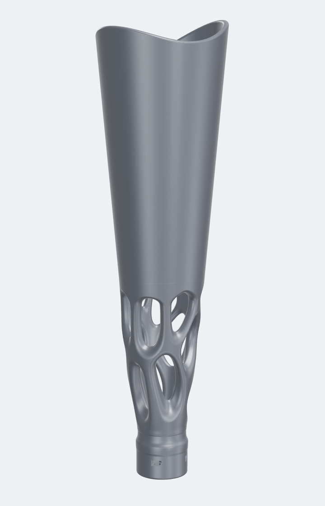
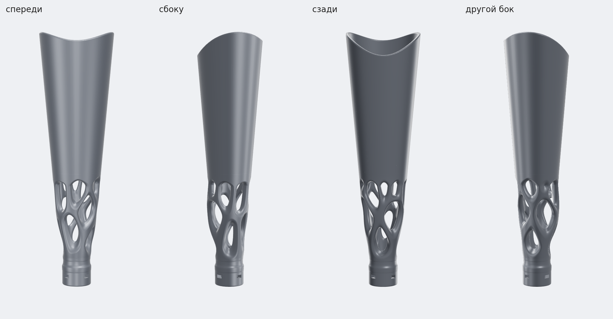
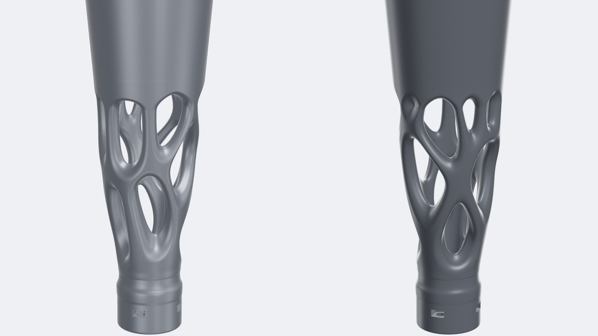
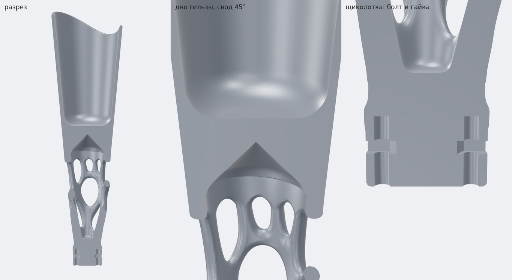
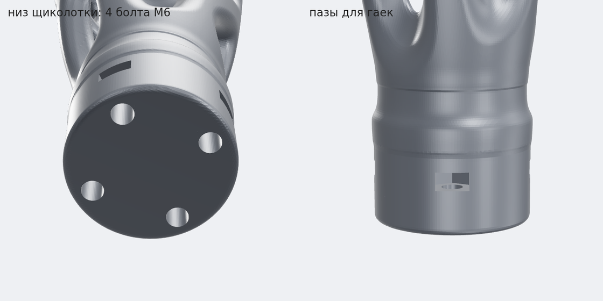
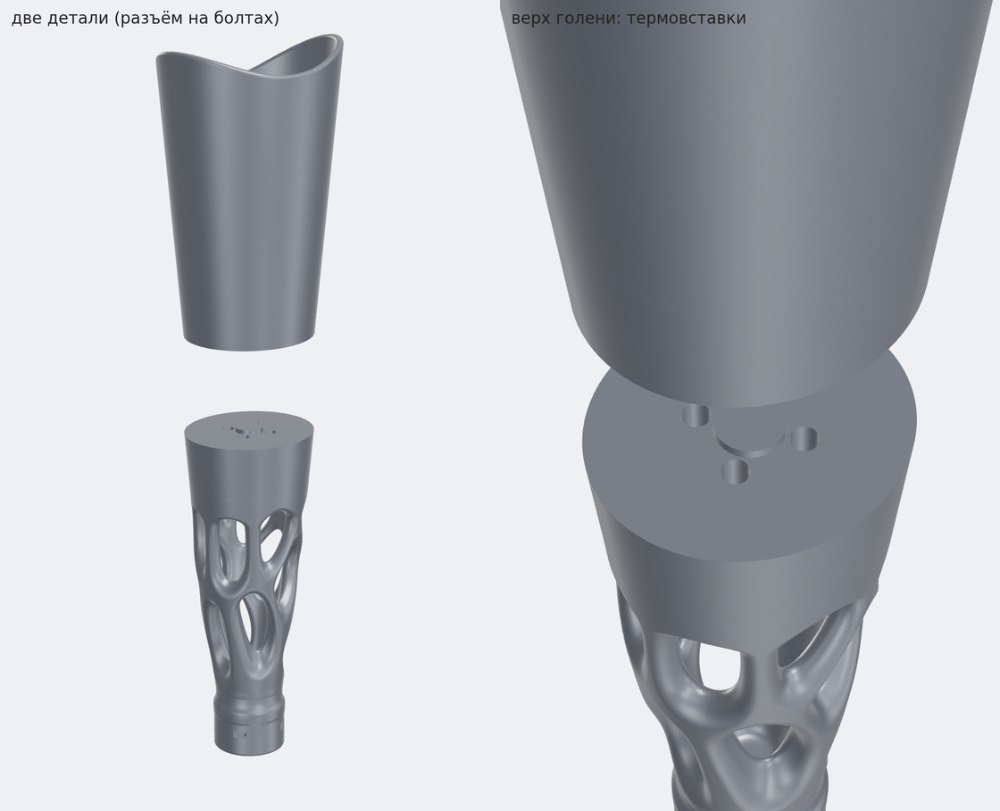

# Протез голени с ажурной «органической» голенью — 3D-модель



Параметрическая 3D-модель транстибиального протеза (ниже колена) в стиле фото:
гладкая гильза плавно переходит в скульптурную голень со случайными вытянутыми окнами,
внизу — цилиндр «щиколотки» под стандартную протезную стопу.

Точную копию по одной фотографии снять нельзя (нет размеров, не видно задней стороны и внутренней
части), поэтому модель повторяет стиль, пропорции и устройство, а все размеры подгоняются
под конкретного человека параметрами генератора.

**Что внутри папки**

| Файл | Что это |
|---|---|
| `stl/prosthesis_full.stl` | цельная модель, 128 × 112 × 439 мм |
| `stl/prosthesis_part1_socket.stl` | гильза отдельно (203 мм в высоту) |
| `stl/prosthesis_part2_pylon.stl` | голень + щиколотка отдельно (239 мм) |
| `stl/info.json` | размеры, объём, масса, прочность сечений по высоте |
| `generate_prosthesis.py` | генератор: меняете параметры → получаете новые STL за ~20 с |
| `images/` | рендеры |

<br clear="right">

## ⚠️ Сначала про безопасность

Протез — несущее медицинское изделие: на него приходится весь вес тела, при ходьбе — больше веса,
и так миллионы шагов. Поэтому:

- **Модель не проходила прочностных расчётов и испытаний.** Настоящие протезы проверяют по стандарту
  ISO 10328 (статические и многомиллионные циклические нагрузки). Если пластиковая голень лопнет
  на ходу — это падение и травма.
- **Гильза в модели — усреднённая заготовка.** Настоящая гильза делается протезистом по слепку или
  3D-скану культи. Неподходящая гильза за день натирает кожу до ран.
- **Домашняя FDM-печать (PLA, PETG) слоистая** и ломается по слоям, особенно от повторяющихся
  нагрузок. PLA к тому же хрупкий и размягчается уже около 55–60 °C (например, в машине летом).
- Самое слабое место модели — голень на высоте ~72 мм от низа: момент сопротивления сечения
  ≈ 7,1 см³ (подробный профиль — в `stl/info.json`, пригодится инженеру).

Что можно смело делать: напечатать для примерки внешнего вида, как выставочную/настольную модель
(например, в масштабе 1:2 или 1:3), показать протезисту как идею. Чтобы на этом **ходить**, модель
нужно отдать протезисту/инженеру: гильзу — по скану культи, печать — промышленную (MJF/SLS из
нейлона PA12/PA11 или титан), затем проверка и испытания.

## Как устроена модель



1. **Гильза** — «чашка» под культю с плоским скруглённым дном и анатомическим краем: по бокам выше,
   сзади выемка под сгиб колена. Стенка 5 мм, дно 14 мм. Под дном — полый свод с наклоном 45°,
   чтобы печатать без поддержек.
2. **Голень** — оболочка формы ноги (сужается к щиколотке, сзади выпуклость как у икры). Окна
   расставлены случайно и не повторяются; перемычки между ними — скруглённые ленты разной ширины,
   которые перетекают друг в друга без «узлов». К щиколотке стенка и перемычки толще, окна мельче:
   там максимальная нагрузка.
3. **Щиколотка** — цилиндр Ø50 мм с плоским низом: 4 отверстия M6 под стандартный 4-дырочный
   адаптер стопы и боковые пазы, куда вставляются гайки.



Разрез: полость гильзы, свод 45° под дном, болты и гайки в щиколотке.



## Что докупить

Стопу печатать не нужно, на фото тоже серийная стопа с косметической оболочкой.

- **Протезная стопа** с пирамидкой (male pyramid), например SACH или карбоновая, и косметическая
  оболочка стопы (бежевая «нога» на фото).
- **4-дырочный адаптер-приёмник пирамидки** (4-hole female pyramid adapter): прикручивается к низу
  щиколотки, в него вставляется пирамидка стопы.
- **4 болта M6 + 4 гайки M6** (DIN 934) для адаптера. Длина болта ≈ толщина фланца адаптера + 21…28 мм
  (например, M6×30 при фланце 8 мм). Гайки вставляются в боковые пазы щиколотки.
- **Лайнер и наколенник-рукав** (серые рукава на фото): подбираются протезистом.
- **Дистальная подушка** на дно гильзы, мягкая вставка под торец культи.
- Для варианта из двух частей ещё **4 термовставки M6** (под отверстие Ø8, длиной до 14 мм) и
  **4 потайных болта M6×20** (ISO 10642 / DIN 7991).

> ❗ Расстояние между отверстиями 4-дырочных адаптеров у разных производителей разное. Измерьте своё
> (между центрами **соседних** отверстий) и задайте `--adapter-hole-spacing`. По умолчанию 26 мм.



## Как подогнать под себя

Нужен Python 3.10+:

```bash
pip install -r requirements.txt
python generate_prosthesis.py --pylon-length 230 --socket-depth 170 --socket-top-radius 53
```

STL появятся в `stl/`, в консоли будут размеры, масса и самое слабое сечение.

Главные мерки, всё в миллиметрах:

| Параметр | По умолчанию | Как определить |
|---|---|---|
| `--socket-top-radius` | 55 | обхват культи в лайнере на уровне середины надколенника ÷ 6,28 |
| `--socket-distal-radius` | 41 | обхват культи в лайнере в ~2 см от торца ÷ 6,28 |
| `--socket-depth` | 180 | длина от середины надколенника до торца культи + 5…10 мм на подушку |
| `--pylon-length` | 245 | высота дна гильзы над полом − высота стопы с адаптером (от пола до низа щиколотки) |
| `--adapter-hole-spacing` | 26 | расстояние между центрами соседних отверстий вашего 4-дырочного адаптера |

Внешний вид:

| Параметр | По умолчанию | Что меняет |
|---|---|---|
| `--seed` | 5 | другой случайный узор окон (попробуйте 8, 13, 21…) |
| `--hole-size` | 28 | шаг окон: больше — окна крупнее и их меньше |
| `--band-width` | 6.5 | ширина перемычек между окнами |
| `--band-variation` | 0.4 | разброс ширины перемычек, больше — «рукотворнее» |
| `--hole-stretch` | 2.0 | вытянутость окон по вертикали |
| `--shell-thickness` | 10 | толщина стенки голени |
| `--calf-bulge` | 0.18 | выпуклость «икры» сзади |
| `--mirror` | — | зеркальная копия для второй ноги (на фото пара протезов) |

Все параметры: `python generate_prosthesis.py --help`. Быстрый черновик: `--voxel 1.2`.

## Как печатать

- **Ориентация** — как в файле, стоя: щиколоткой на стол; гильза из двух частей — плоским низом на стол.
- **Поддержки** почти не нужны: свод под гильзой 45°, окна вытянуты вертикально. Перед печатью
  проверьте превью слайсера: верх отдельных окон может просить поддержку.
- **Размер.** Цельная модель высотой 439 мм влезет только в большой принтер. Две части (203 и 239 мм)
  влезают в принтеры с высотой печати от 240 мм, например Bambu Lab P1S/X1C/A1 (256 мм).
- **Настольная модель** — масштаб 30–50 % в слайсере, крепёжные отверстия станут декоративными.
- **Масса** при 100 % заполнении: ~985 г в PETG, ~780 г в нейлоне PA12.
- Для пробной печати лучше PETG, ABS или ASA, 5–6 периметров. PLA — только для выставочной модели.

## Сборка варианта из двух частей



1. Вплавьте паяльником 4 термовставки M6 в отверстия на верхнем торце голени.
2. Поставьте гильзу на голень: центрирующий выступ входит в углубление. Изнутри гильзы закрутите
   4 потайных болта M6×20, головки утопают заподлицо с дном.
3. Положите на дно гильзы дистальную подушку.
4. Вставьте гайки M6 в боковые пазы щиколотки, прикрутите снизу 4-дырочный адаптер и вставьте в него
   пирамидку стопы. Сборку и юстировку (наклоны, ротацию) стопы делает протезист.

## Как это сделано

Генератор описывает форму полем расстояний (SDF). Окна — ячейки Вороного вокруг случайных точек
на поверхности голени (Poisson-disk, вытянутая по вертикали метрика). Перемычки — полосы вдоль
границ ячеек, у каждой своя ширина. Углы окон и кромки скруглены. Затем marching cubes,
упрощение сетки и точные булевы операции [manifold3d](https://github.com/elalish/manifold) для
отверстий, пазов и разреза. Все STL проверены: замкнутые, одна деталь, нормали наружу.
